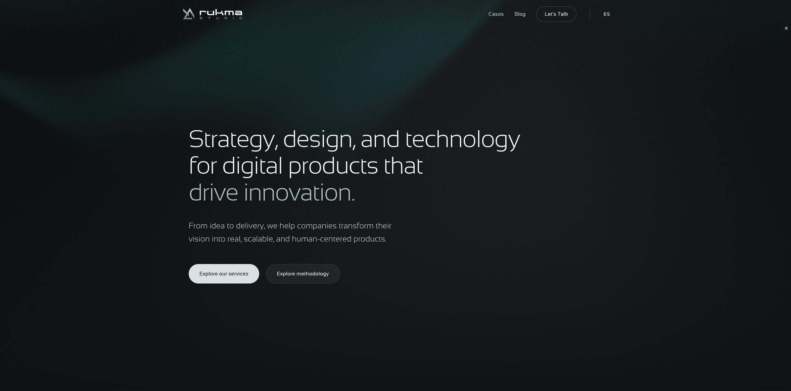

<div align="center">
  

  # 🌟 Rukma Studio

  ### Estrategia, diseño y tecnología para productos digitales que generan impacto.

  [](https://nextjs.org/)
  [](https://react.dev/)
  [](https://tailwindcss.com/)
  [](https://www.typescriptlang.org/)

  [🌐 Sitio Web](https://rukma.studio) | [📨 Hablemos](mailto:hola@rukma.studio)

</div>

---

## 🚀 Sobre Rukma Studio

**Rukma Studio** ayuda a empresas, startups y equipos digitales a diseñar, validar y construir productos digitales. Conectamos la visión del negocio con las necesidades del usuario mediante procesos ágiles y un enfoque centrado en la excelencia visual y técnica.

---

## 🛠️ Áreas de Especialización

### 1. 🎨 Diseño y Estrategia de Experiencia (UX + Product Design)
Diseñamos experiencias digitales claras, útiles y centradas en las personas.
- **Discovery & Research**: Análisis de competencia, entrevistas con usuarios y definición estratégica.
- **Diseño UI/UX**: Flujos de usuario, wireframes, prototipos navegables en Figma y sistemas de diseño adaptables.
- **Handoff Eficiente**: Documentación funcional detallada para un desarrollo técnico sin fricciones.

### 2. 💻 Prototipado MVP y Codificación
Convertimos ideas y diseños en prototipos funcionales y MVPs interactivos.
- **Desarrollo Front-End**: Implementación rápida y optimizada utilizando tecnología moderna.
- **Validación Rápida**: Prototipos interactivos para pruebas con usuarios reales o presentaciones comerciales.
- **Stack Tecnológico**: Next.js, React, Tailwind CSS y animaciones fluidas con Framer Motion.

### 3. 🎯 Brand Experience e Identidad
Construimos y evolucionamos identidades de marca preparadas para el entorno digital.
- **Sistemas Visuales**: Paletas de colores curadas, tipografías y recursos de marca consistentes.
- **Tono de Voz & Copywriting**: Definición de la personalidad y narrativa de la marca.
- **Brand Kits**: Guías de estilo para asegurar consistencia visual en todos los canales.

---

## 💻 Stack Tecnológico del Proyecto

Este proyecto está construido con herramientas modernas de desarrollo web:

- **Framework**: [Next.js 16 (App Router)](https://nextjs.org/)
- **Librería de UI**: [React 19](https://react.dev/)
- **Estilos**: [Tailwind CSS v4](https://tailwindcss.com/) con soporte nativo de PostCSS.
- **Animaciones**: [Framer Motion](https://www.framer.com/motion/) para micro-interacciones de alta gama.
- **Efectos Visuales**: [OGL](https://github.com/oogl/ogl) (WebGL de alto rendimiento) para la experiencia inmersiva del fondo.
- **Tipografía & Iconos**: [Lucide React](https://lucide.dev/) para iconos vectoriales fluidos.

---

## ⚙️ Configuración y Desarrollo Local

### Requisitos Previos
- Node.js (versión 18 o superior recomendada)
- npm, yarn, pnpm o bun

### Instalación de Dependencias

```bash
npm install
```

### Ejecutar el Servidor de Desarrollo

El servidor de desarrollo ejecuta concurrentemente el servidor de Next.js y el script que vigila y actualiza los tokens de diseño:

```bash
npm run dev
```

El sitio estará disponible en [http://localhost:3000](http://localhost:3000).

### Scripts Disponibles

- `npm run dev`: Ejecuta el entorno de desarrollo con sincronización de diseño en tiempo real.
- `npm run build`: Compila la aplicación optimizada para producción.
- `npm run start`: Inicia el servidor de Next.js en modo producción.
- `npm run lint`: Ejecuta ESLint para analizar la calidad y estilo del código.

---

## 🎨 Sistema de Diseño

El proyecto cuenta con un sistema de tokens administrado desde [DESIGN.md](file:///Users/fcophox/code/rukma-studio/DESIGN.md). Las modificaciones en el archivo JSON de colores de dicho documento se compilan y aplican automáticamente a `src/app/globals.css` mediante el script `watch-theme.mjs`.


---

## 👨‍💻 About the Author

**Francisco Hormazábal (fcoPhox)**  
*UX Engineer & Product Design Consultant*

I bridge the gap between design and engineering. With certifications spanning all 3 levels of UX-PM by the UX Alliance, my work is driven by data, user research, and AI-assisted workflows. I specialize in:
- **UX Research & Strategy:** Data-driven decisions and problem framing.
- **Product Design (UX/UI):** High-fidelity prototyping and design systems.
- **Frontend Engineering:** Modern, performant implementations using React, Next.js, and Tailwind CSS.
- **AI & Innovation Consulting:** Rapid iteration using AI tools to bring MVPs to life.

Connect with me on [LinkedIn](https://www.linkedin.com/in/fcophox/) or explore my work here on [GitHub](https://github.com/fcophox).

---